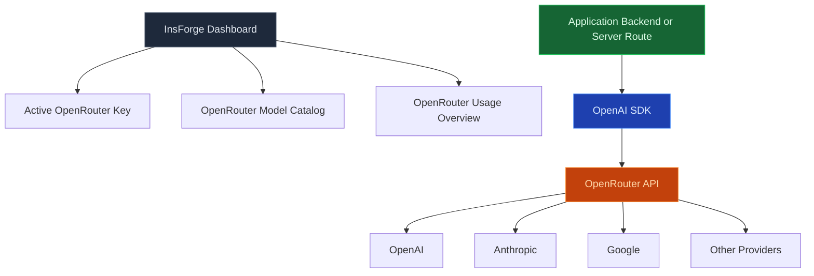

## Overview

InsForge Model Gateway provisions an OpenRouter API key and model catalog so developers can build AI features directly against OpenRouter. Application code should use OpenRouter's OpenAI-compatible API with the OpenAI SDK, not the deprecated InsForge AI proxy endpoints.

This gives applications the full OpenRouter feature surface: provider routing, model-specific parameters, multimodal inputs and outputs, embeddings, web search, image generation, video generation, and any new capabilities OpenRouter adds.

## Architecture



## Model Gateway Role

| Component | Purpose |
|-----------|---------|
| **Dashboard Quick Start** | Shows the active OpenRouter key and copyable OpenAI SDK examples |
| **`GET /api/ai/openrouter/api-key`** | Returns the active OpenRouter key for admin copy workflows |
| **`GET /api/ai/models`** | Returns the live OpenRouter model catalog, filtered with `output_modalities=all` |
| **`GET /api/ai/overview`** | Returns key-level OpenRouter usage and activity charts when available |
| **Application code** | Calls `https://openrouter.ai/api/v1` directly with the OpenAI SDK or HTTP |

## OpenRouter Key Resolution

InsForge resolves the active OpenRouter key from the deployment environment:

| Environment | Source |
|-------------|--------|
| **InsForge Cloud** | Cloud-managed OpenRouter credential fetched for the project |
| **Self-hosted** | `OPENROUTER_API_KEY` from the backend environment |

The dashboard exposes the active key to admins so they can copy it into their application server environment. Keep this key private and use it only from trusted backend code, server routes, functions, or local development scripts.

## Direct OpenRouter Integration

Install the OpenAI SDK:

```bash
npm install openai
```

Create a client that points at OpenRouter:

```typescript
import OpenAI from 'openai';

const openai = new OpenAI({
  baseURL: 'https://openrouter.ai/api/v1',
  apiKey: process.env.OPENROUTER_API_KEY,
  defaultHeaders: {
    'HTTP-Referer': 'https://your-app.example',
    'X-Title': 'Your App',
  },
});

const completion = await openai.chat.completions.create({
  model: 'openai/gpt-4o',
  messages: [{ role: 'user', content: 'Say this is a test.' }],
});

console.log(completion.choices[0]?.message?.content);
```

<Note>
OpenRouter documents the OpenAI SDK integration with `baseURL: "https://openrouter.ai/api/v1"` and bearer-token authentication. Use OpenRouter's docs for the latest model parameters and provider-specific capabilities.
</Note>

## Model Discovery

The dashboard and `GET /api/ai/models` read the public OpenRouter model catalog directly. Model IDs use OpenRouter's `provider/model` format, such as:

| Provider | Example model IDs |
|----------|-------------------|
| **OpenAI** | `openai/gpt-4o`, `openai/gpt-4o-mini` |
| **Anthropic** | `anthropic/claude-sonnet-4.5`, `anthropic/claude-3.5-haiku` |
| **Google** | `google/gemini-2.5-pro`, `google/gemini-2.5-flash-image` |
| **xAI** | `x-ai/grok-4` |
| **DeepSeek** | `deepseek/deepseek-chat`, `deepseek/deepseek-r1` |

<Note>
Model availability changes over time. Use the dashboard, `GET /api/ai/models`, or OpenRouter's model catalog for the current list.
</Note>

## Capabilities

Because app code calls OpenRouter directly, supported capabilities are determined by OpenRouter and the selected model:

| Capability | Integration path |
|------------|------------------|
| **Chat completions** | OpenAI SDK `chat.completions.create()` with OpenRouter `baseURL` |
| **Streaming** | OpenAI SDK streaming support |
| **Reasoning** | OpenRouter `reasoning` parameters for supported models, including effort and reasoning-token controls |
| **Tool calling** | OpenRouter/OpenAI-compatible tool definitions |
| **Web search** | OpenRouter plugins or model-native web search parameters |
| **Image inputs** | Multimodal message content for models that support vision |
| **Image outputs** | Models that support `modalities: ['image', 'text']` |
| **Embeddings** | OpenAI SDK `embeddings.create()` with an OpenRouter embedding model |
| **Video generation** | OpenRouter video endpoints via HTTP |

## Deprecated SDK and Proxy Surface

The previous InsForge-hosted AI proxy remains available for existing apps, but it is deprecated. New integrations should not use these InsForge SDK methods:

| SDK method | Replacement |
|------------|-------------|
| `insforge.ai.chat.completions.create()` | OpenAI SDK `chat.completions.create()` with `baseURL: "https://openrouter.ai/api/v1"` |
| `insforge.ai.images.generate()` | OpenRouter image-capable models and multimodal output parameters |
| `insforge.ai.embeddings.create()` | OpenAI SDK `embeddings.create()` with the OpenRouter `baseURL` |

The matching backend proxy endpoints are also deprecated:

| Method | Endpoint | Auth | Status |
|--------|----------|------|--------|
| POST | `/api/ai/chat/completion` | User | Deprecated compatibility proxy |
| POST | `/api/ai/image/generation` | User | Deprecated compatibility proxy |
| POST | `/api/ai/embeddings` | User | Deprecated compatibility proxy |

Avoid adding new examples or new application code that depends on these routes. They hide OpenRouter-specific functionality and require InsForge to keep adapting request/response shapes as OpenRouter evolves.

## Admin Helper Endpoints

| Method | Endpoint | Auth | Description |
|--------|----------|------|-------------|
| GET | `/api/ai/models` | Admin | List live OpenRouter models |
| GET | `/api/ai/overview` | Admin | Show key-level usage and activity when available |
| GET | `/api/ai/openrouter/api-key` | Admin | Return the active key and a masked display value |

## Security Practices

<CardGroup cols={2}>
  <Card title="Keep Keys Server-Side" icon="key">
    Store `OPENROUTER_API_KEY` in server-only environment variables.
  </Card>

  <Card title="Use Backend Routes" icon="shield-check">
    Browser apps should call your own backend route, not OpenRouter directly with a public key.
  </Card>

  <Card title="Protect Project Credits" icon="gauge">
    Gate AI routes with app-level auth, authorization, and input validation before spending provisioned credits.
  </Card>

  <Card title="Limit Expensive Work" icon="sliders">
    Apply app-specific quotas, prompt length limits, and request timeouts around user-triggered AI calls.
  </Card>

  <Card title="Use Current Model Docs" icon="book">
    Check OpenRouter's model docs for supported parameters before relying on a capability.
  </Card>
</CardGroup>

## SDK References

Choose the AI integration guide for your platform:

<CardGroup cols={2}>
  <Card title="TypeScript" icon="js" href="/sdks/typescript/ai">
    OpenAI SDK setup for Node.js, Next.js, and server-side TypeScript apps
  </Card>

  <Card title="Swift" icon="apple" href="/sdks/swift/ai">
    Secure backend-bound patterns for iOS, macOS, tvOS, and watchOS apps
  </Card>

  <Card title="Kotlin" icon="smartphone" href="/sdks/kotlin/ai">
    Secure backend-bound patterns for Android and Kotlin Multiplatform apps
  </Card>

  <Card title="REST" icon="code" href="/sdks/rest/ai">
    Direct HTTP examples for OpenRouter plus InsForge admin helper endpoints
  </Card>
</CardGroup>
