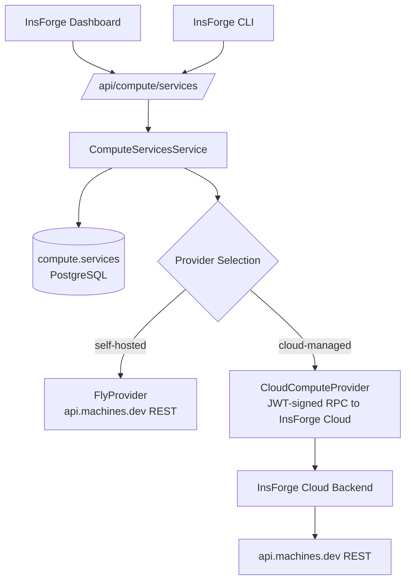

## Overview

You have a Docker image. You want it running somewhere with a public HTTPS URL, with env vars you can rotate, that doesn't fall over when you redeploy. Compute is the InsForge feature for that.

Each compute service is one [Fly.io machine](https://fly.io/docs/machines/) provisioned and managed by your InsForge backend. You point at an image (or a directory with a `Dockerfile`), pick a CPU / memory / region, and the backend handles the rest: app create, IP allocation, machine launch, env-var encryption, lifecycle.

Compute is **not** a serverless platform. Services are always-on machines (with optional auto-stop on idle). For event-driven, short-lived code that scales to zero between requests, use [Edge Functions](/core-concepts/functions/architecture) instead.

<Note>
**Compute is in private preview and InsForge isn't billing for it yet** — using it on InsForge Cloud is currently free. Self-hosted users still pay Fly.io directly though, since the machines run on your own Fly account. A `shared-1x` machine with 256 MB of RAM is about $2/month if it stays running. Pricing details: [fly.io/pricing](https://fly.io/pricing).
</Note>

## Using the InsForge CLI

The [InsForge CLI](https://github.com/InsForge/CLI) is the primary way to drive compute and hits the same `/api/compute/services` routes as the dashboard. If you haven't used it before, the [quickstart](/quickstart) walks through install and login once. The examples below use `npx @insforge/cli` directly — the first command that needs auth will open the browser login flow if you haven't run it yet.

### Deploy from a pre-built image

If your image already lives in a registry (Docker Hub, GHCR, ECR, anywhere your InsForge backend can reach), this is the simplest path. No Docker daemon, no `flyctl`, nothing built locally.

```bash
npx @insforge/cli compute deploy \
  --name my-api \
  --image nginx:alpine \
  --port 80 \
  --memory 256
```

That's it. The backend creates a Fly app, allocates IPs, launches the machine, and prints the public URL. Most deploys take 15–30 seconds.

### Deploy from local source

If you have a directory with a `Dockerfile` and want InsForge to handle the build for you:

```bash
# Requires flyctl on PATH (https://fly.io/docs/flyctl/install/).
# No local Docker daemon needed — the build runs on Fly's remote builder.
npx @insforge/cli compute deploy ./my-app \
  --name my-api \
  --port 8080 \
  --memory 512
```

Under the hood, the CLI does this in two steps:

1. Asks the backend to create the Fly app shell and mint a short-lived (20 minute), per-app deploy token.
2. Runs `flyctl deploy --remote-only --build-only` against your directory, which ships the source tarball to Fly's remote builder, builds the image there, and pushes it to `registry.fly.io/<app>:<tag>`. Once that finishes, the CLI tells the backend to launch the machine pointing at the freshly-pushed image.

The deploy token is scoped to **one app** with `else: deny` — it cannot deploy or read anything else in the InsForge Fly org. It expires in 20 minutes.

### Redeploy is just deploy

`compute deploy` is upsert-style. If a service with the same `--name` already exists in this project, it patches that service instead of failing. The same command in CI rolls out a new image; the same command run locally pushes a hotfix. There is no separate "deploy vs. update" mental model.

### Manage running services

```bash
npx @insforge/cli compute list                    # list all services in the project
npx @insforge/cli compute get <id>                # show one service (env values redacted)
npx @insforge/cli compute events <id> --limit 50  # recent Fly machine events (start/stop/exit)
npx @insforge/cli compute stop <id>               # stop the machine; row + Fly app retained
npx @insforge/cli compute start <id>              # start a stopped machine
npx @insforge/cli compute delete <id>             # destroy machine + app + DB row
```

`stop` keeps the row and the Fly app, so `start` brings the same machine back at the same URL. `delete` is destructive — the row, the Fly app, and the machine all go away.

### Rotate one secret without restating the others

This is the part that bites people who use `--env`. The `--env` flag replaces **all** env vars with whatever JSON you pass it, so if you only meant to update `STRIPE_KEY` and you passed `--env '{"STRIPE_KEY":"..."}'`, you just wiped `DATABASE_URL`, `REDIS_URL`, and everything else.

Use the patch flags instead:

```bash
# Add or update one var, leave the rest alone:
npx @insforge/cli compute update <id> --env-set DATABASE_URL=postgres://...

# Multiple at once (the flag is repeatable):
npx @insforge/cli compute update <id> \
  --env-set DATABASE_URL=postgres://... \
  --env-set REDIS_URL=redis://...

# Remove one var:
npx @insforge/cli compute update <id> --env-unset OLD_SECRET
```

`--env-set` and `--env-unset` merge with the current env. `--env` replaces wholesale. The two modes are mutually exclusive — picking both returns a `400`.

Other update flags (`--image`, `--port`, `--cpu`, `--memory`) work the same as on `deploy`. Updating image / port / CPU / memory restarts the Fly machine in place. The machine ID and IP stay the same, so DNS and any clients pointing at the URL keep working through the restart.

### Common deploy flags

| Flag | Notes |
|------|-------|
| `--name <name>` | Required. DNS-safe (e.g. `my-api`). The Fly app is named `<name>-<projectId>`. |
| `--image <url>` | Pre-built image. Mutually exclusive with the positional source directory. |
| `[dir]` | Path to a directory with a `Dockerfile`. Triggers source mode. |
| `--port <n>` | Container port. Default `8080`. |
| `--cpu <tier>` | `<kind>-<N>x` format: `shared-1x`, `shared-2x`, `performance-1x`, `performance-2x`, etc. Default `shared-1x`. |
| `--memory <mb>` | MB. Default `512`. |
| `--region <region>` | Fly region code (`iad`, `sjc`, `fra`, ...). Default `iad`. **Cannot be changed in-place** after first deploy — delete and redeploy if you need to move regions. |
| `--env '<json>'` | Replace all env vars with this JSON object. Single-quote it so your shell doesn't expand `$`. |
| `--env-file <path>` | Read env vars from a `.env`-style file. Mutually exclusive with `--env`. |

All commands accept `--json` for scripting.

## From the dashboard

The **Compute** page in the dashboard exposes the same flows as a dialog: name, image URL, port, CPU profile, memory, region, env vars. It hits the same `/api/compute/services` routes the CLI does — there's no parallel implementation, no drift between the two surfaces.

## Service lifecycle

| Status | Meaning |
|--------|---------|
| `creating` | DB row inserted, Fly app being created. |
| `deploying` | Source-mode only: app exists, waiting for the CLI to push the built image and trigger machine launch. |
| `running` | Machine is up and serving traffic. |
| `stopped` | You stopped the machine. The row and Fly app stay; `start` brings it back. |
| `failed` | Something went wrong. Run `npx @insforge/cli compute events <id>` to see Fly's last lifecycle event. |
| `destroying` | Delete in progress. |

A successful delete drops the row entirely. There's no `destroyed` state to query — if `compute list` doesn't show it, it's gone.

`compute events <id>` returns Fly machine **lifecycle** events (`start`, `stop`, `exit`, `restart`). It does **not** stream container stdout/stderr — that's [a separate piece of work](#limitations).

## How it fits together



The provider is selected once when the backend starts. `FLY_API_TOKEN` set? You're on `FlyProvider`, talking directly to Fly's REST API. Otherwise, `PROJECT_ID` (not `local`) plus `CLOUD_API_HOST` set? You're on `CloudComputeProvider`, proxying through InsForge Cloud. Neither? You get the `503 COMPUTE_NOT_CONFIGURED` setup card.

The decision sticks for the lifetime of the process — switching modes requires a restart. Env vars set on a service are encrypted at rest with AES-256-GCM and decrypted only when handed to Fly at machine launch. The dashboard's GET path returns env-var keys but never values.

<Warning>
The encryption key is derived from `ENCRYPTION_KEY`, falling back to `JWT_SECRET` if `ENCRYPTION_KEY` isn't set. **Rotating `JWT_SECRET` without a separate `ENCRYPTION_KEY` corrupts every encrypted env-var blob in the database**, across all features that use `EncryptionManager` — not just compute. Set `ENCRYPTION_KEY` to a dedicated 32+ char value before going to production if you need rotation flexibility later.
</Warning>

## API surface

All endpoints require admin auth (`Authorization: Bearer <jwt>` or `x-api-key: ik_...`).

| Method | Endpoint | Description |
|--------|----------|-------------|
| GET | `/api/compute/services` | List services in the current project |
| GET | `/api/compute/services/:id` | Get one service. Env values are never returned, only keys. |
| POST | `/api/compute/services` | Create + launch a service in one call (image mode) |
| POST | `/api/compute/services/deploy` | Create the Fly app without launching a machine. The CLI uses this for source-mode deploys. |
| POST | `/api/compute/services/:id/deploy-token` | Mint a 20-minute, app-scoped Fly deploy token |
| PATCH | `/api/compute/services/:id` | Update image / port / CPU / memory / env. `envVars` and `envVarsPatch` are mutually exclusive. |
| POST | `/api/compute/services/:id/start` | Start a stopped machine |
| POST | `/api/compute/services/:id/stop` | Stop the machine. Row + Fly app retained. |
| DELETE | `/api/compute/services/:id` | Destroy the machine, app, and DB row. Returns an audit snapshot. |
| GET | `/api/compute/services/:id/events` | Fly machine lifecycle events. Not stdout/stderr. |

## Limitations

<CardGroup cols={2}>
  <Card title="No container logs yet" icon="terminal">
    `compute events` returns Fly machine lifecycle events (start/stop/exit). Streaming container stdout/stderr is on the roadmap and will reuse the now-vacated `compute logs` command name when it ships.
  </Card>

  <Card title="One machine per service" icon="server">
    Each service is exactly one Fly machine. Multi-region replicas, autoscale, and process groups are not yet exposed.
  </Card>

  <Card title="No cron or one-shot tasks" icon="clock">
    The current API only models long-running services. Scheduled tasks and one-shot jobs are not in the current release.
  </Card>

  <Card title="No token entry in the dashboard" icon="key">
    `FLY_API_TOKEN` is read from the environment only. If you want to swap tokens, edit `.env` and restart.
  </Card>
</CardGroup>

## Troubleshooting

### Service stuck in `creating`

The Fly app got created but the machine never reached `running`. Run `npx @insforge/cli compute events <id>` to see Fly's last lifecycle event. The two most common causes:

1. **Image pull failed.** A private registry image without `imagePullSecrets` configured (not yet exposed in the API).
2. **Port mismatch.** The container's `EXPOSE` doesn't match the `--port` you passed.

### Service stuck in `deploying` (source mode)

The CLI created the app but never followed up with the image push. Usually means `flyctl` failed before pushing — network blip, build failure, expired deploy token. Re-run `npx @insforge/cli compute deploy` against the same `--name`. The CLI tolerates "app already exists" and resumes the flow.

### `unauthorized` from Fly

The token and org slug don't match. Re-mint the token against the right org and re-check `FLY_ORG` against `fly orgs list` — it has to be the slug (lowercase, no spaces), not the display name.
