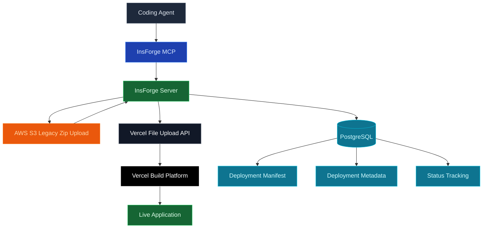
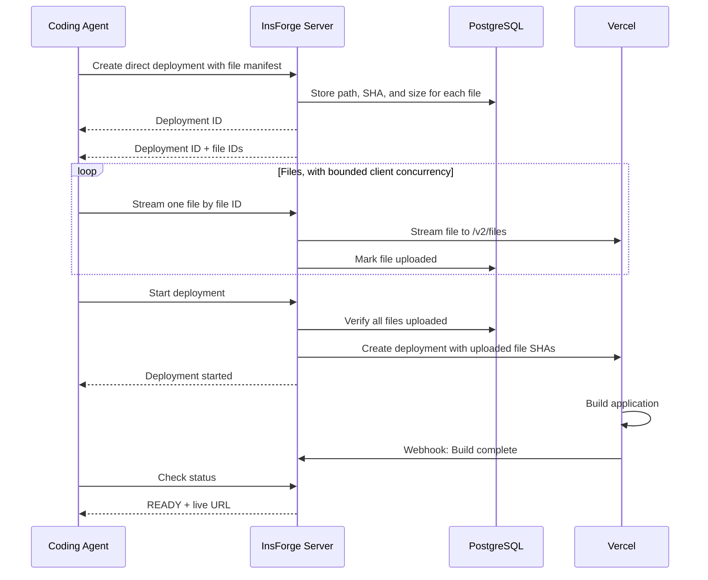

## Overview

InsForge Deployments enable developers to deploy web applications with a single prompt. By integrating with coding agents via InsForge MCP, developers can simply say "Deploy my app" and have their application live within a minute—no configuration required.

## Technology Stack

## Core Components

| Component | Technology | Purpose |
|-----------|------------|---------|
| **Legacy Uploads** | AWS S3 | Backward-compatible source zip staging |
| **Upload Proxy** | Express streaming endpoint | Upload files to Vercel without exposing provider credentials |
| **Build Platform** | Vercel | Production builds and hosting |
| **Status Tracking** | PostgreSQL | Deployment state, direct-upload manifest, and metadata |
| **Webhook Handler** | HMAC-SHA1 | Real-time build status updates |

## How It Works

### Deployment Flow

### Step-by-Step Process

#### Direct Upload Flow

1. **Create Deployment**: Agent calls `POST /api/deployments/direct` with each relative file path, SHA-1 digest, and byte size; InsForge stores the manifest and returns a deployment ID plus a file ID for each manifest entry
2. **Upload Files**: Agent streams each file to `PUT /api/deployments/:id/files/:fileId/content` using bounded client-side concurrency; InsForge validates bytes against the manifest and forwards the stream to Vercel without exposing Vercel credentials
3. **Retry If Needed**: If an upload is interrupted, the agent can retry individual file uploads for the same deployment ID. To inspect progress, query `deployments.files` with a raw SQL tool for that `deployment_id`
4. **Start Build**: Agent calls `POST /api/deployments/:id/start`; InsForge verifies every manifest file was uploaded, then creates the Vercel deployment with uploaded file SHAs
5. **Build & Deploy**: Vercel builds the application and deploys to its edge network
6. **Go Live**: Application becomes available at `https://{app-key}.insforge.site`

#### Legacy Zip Flow

1. **Create Deployment**: Agent calls `POST /api/deployments` and receives a presigned S3 upload URL
2. **Upload Source Zip**: Agent uploads a zip archive to S3
3. **Start Build**: InsForge downloads the zip, extracts source files, uploads them to Vercel, and creates the deployment
4. **Build & Deploy**: Vercel builds the application and deploys to its edge network
5. **Go Live**: Application becomes available at `https://{app-key}.insforge.site`

The entire process typically completes in about one minute.

## Deployment Status

| Status | Description |
|--------|-------------|
| `WAITING` | Deployment created, awaiting source zip upload or direct file uploads |
| `UPLOADING` | Source files are being proxied to Vercel or deployment creation is in progress |
| `QUEUED` | Build queued on Vercel |
| `BUILDING` | Application being built |
| `READY` | Live and accessible |
| `ERROR` | Build failed |
| `CANCELED` | Deployment canceled |

## Environment Variables

Environment variables can be passed during deployment for build-time configuration. They are encrypted at rest and in transit, and are only accessible during the build process. For auditing purposes, only variable names are logged, never values.

<Warning>
  While environment variables are encrypted, avoid storing sensitive credentials in frontend applications. Variables prefixed with `NEXT_PUBLIC_` or similar are embedded in client bundles.
</Warning>

## Current Limitations

<Note>
  Deployments currently has the following constraints:
</Note>

| Limitation | Details |
|------------|---------|
| **Environment** | Production deployments only |
| **Custom Domains** | Coming soon |
| **Preview Deployments** | Coming soon |
| **Build Logs** | Limited visibility |

## Performance

### Direct Upload Optimization

Deployment uploads stream through InsForge directly into Vercel's file upload API, enabling:

- **Lower Memory Use**: Source zips are no longer buffered and unzipped by the backend for direct-capable clients
- **Credential Safety**: Vercel credentials remain server-side while clients upload individual files
- **Compatibility**: Existing zip/S3 clients can continue using the legacy deployment entrypoint
- **Rapid Builds**: Vercel's distributed build infrastructure
- **Global Distribution**: Deployed applications served from edge locations worldwide
- **Low Latency**: Sub-100ms response times for static assets

## Best Practices

<CardGroup cols={2}>
  <Card title="Keep Builds Small" icon="minimize">
    Avoid uploading large assets. Use InsForge Storage and access via URLs.
  </Card>

  <Card title="Use Environment Variables" icon="key">
    Configure builds via env vars, not hardcoded values
  </Card>

  <Card title="Test Locally First" icon="flask">
    Verify builds work locally before deploying
  </Card>

  <Card title="Monitor Status" icon="chart-line">
    Check deployment status for build errors
  </Card>
</CardGroup>
