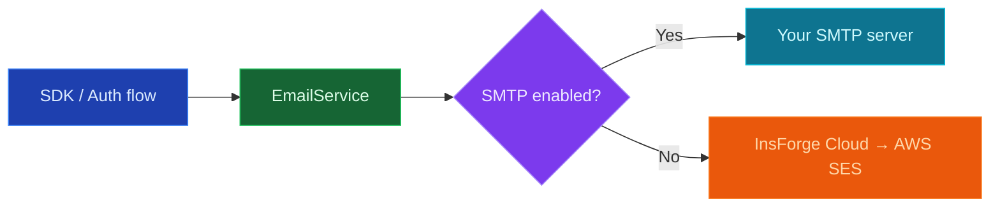

<Warning>
  Email is a private preview feature. APIs and behavior may change.
</Warning>

## Overview

By default, InsForge sends email through its managed cloud (AWS SES). When you configure a custom SMTP server, every outgoing email — both authentication emails (verification, password reset) and `emails.send()` calls — is routed through your provider instead. Switch back at any time by toggling SMTP off; no data migration required.

Use custom SMTP when you want to:

- Send from your own deliverability reputation and domain
- Comply with data-residency requirements that forbid third-party SES
- Self-host InsForge without depending on the cloud email backend
- Customize the look and copy of authentication emails

## How Routing Works

The provider is resolved per-call, so saving SMTP config takes effect immediately — no restart, no redeploy.

## Configuration

Custom SMTP is configured from the dashboard under **Authentication → Email**. The page has two cards: **SMTP Provider** (server credentials) and **Email Templates** (authentication-email content).

<Steps>
  <Step title="Open the Email settings page">
    In the dashboard, navigate to **Authentication → Email**.
  </Step>

  <Step title="Toggle &quot;Enable Custom SMTP&quot;">
    Flip the switch at the top of the **SMTP Provider** card. The form fields become editable.
  </Step>

  <Step title="Enter your SMTP server details">
    Fill in host, port, username, password, sender email, and sender name. Required for every save.
  </Step>

  <Step title="Save">
    InsForge connects to your SMTP server with `transporter.verify()` before persisting. Invalid credentials or unreachable hosts are rejected up-front, so a saved config is always a working config.
  </Step>

  <Step title="Customize templates (optional)">
    With SMTP enabled, the **Email Templates** card unlocks. Edit the four authentication-email templates to match your brand.
  </Step>
</Steps>

### Field reference

| Field | Description |
|-------|-------------|
| **Host** | Hostname or public IP of your SMTP server. Private IPs (`10.x`, `172.16.x`, `192.168.x`, `127.x`, `169.254.x`, IPv6 link-local) are rejected. |
| **Port** | One of `25`, `465`, `587`, `2525`. Port `465` uses implicit TLS; the others use STARTTLS. |
| **Username** | SMTP authentication username. |
| **Password** | SMTP authentication password. Encrypted at rest with AES-256-GCM and never returned by the API — only a `hasPassword: boolean` flag. |
| **Sender email** | The `From:` address on every outgoing email. |
| **Sender name** | Display name shown alongside the sender email. |
| **Min interval (seconds)** | Per-recipient cooldown between sends. Defaults to `60`. Prevents accidental spam loops. |

<Note>
Self-signed TLS certificates are not supported — nodemailer rejects them by default. Use a publicly-trusted certificate on your SMTP server.
</Note>

## Email Templates

When SMTP is enabled, all four authentication-email templates are rendered locally from `email.templates` instead of by InsForge Cloud. The seeded defaults work out of the box; customize them only when you want to.

| Template type | When it sends |
|---------------|---------------|
| `email-verification-code` | New-user verification with a numeric code |
| `email-verification-link` | New-user verification with a clickable link |
| `reset-password-code` | Password reset with a numeric code |
| `reset-password-link` | Password reset with a clickable link |

### Template variables

Templates use `{{ variable }}` placeholders. Available variables depend on the template type:

| Variable | Available in | Notes |
|----------|--------------|-------|
| `{{ token }}` | `*-code` templates | The 6-digit verification or reset code |
| `{{ link }}` | `*-link` templates | Full verification or reset URL. Must start with `http://` or `https://` — non-HTTP values are replaced with `#` |
| `{{ name }}` | All templates | Recipient's display name (system-injected, cannot be overridden) |
| `{{ email }}` | All templates | Recipient's email address (system-injected, cannot be overridden) |

All variable values are HTML-escaped before substitution to prevent XSS. The `name` and `email` variables are always set by InsForge from the user record, so end users cannot spoof them.

<Tip>
Edit a template's HTML directly in the **Email Templates** card. The dashboard shows a live preview as you type.
</Tip>

## Security

- **Encrypted credentials.** Passwords are encrypted with AES-256-GCM before they hit the database. The plaintext only exists in memory at send time.
- **Forced sender.** When SMTP is enabled, the `From:` header is always built from your configured sender email and name, even if the SDK call passed a custom `from`. This prevents callers from spoofing senders through your server.
- **SSRF protection.** Hostnames are resolved and any answer pointing at a private, loopback, link-local, or carrier-NAT range is rejected before connecting.
- **Connect-on-save.** Saving an enabled config performs a real SMTP handshake. Bad credentials or unreachable hosts fail fast.
- **Audit log.** Every save is recorded with action `UPDATE_SMTP_CONFIG`; template edits log `UPDATE_EMAIL_TEMPLATE`.

## Rate Limiting

The **min interval (seconds)** field caps how often a single recipient address can receive email. Sends within the cooldown return HTTP `429` with a `retryAfter` hint. Set to `0` to disable.

This limit is enforced only when SMTP is enabled — the cloud provider has its own per-plan limits documented in [Email Architecture](/core-concepts/email/architecture#rate-limits).

## API Reference

All endpoints require an admin token.

| Method | Path | Description |
|--------|------|-------------|
| `GET` | `/api/auth/smtp-config` | Read SMTP config (password masked) |
| `PUT` | `/api/auth/smtp-config` | Create or update SMTP config; verifies connection when `enabled = true` |
| `GET` | `/api/auth/email-templates` | List all email templates |
| `PUT` | `/api/auth/email-templates/:type` | Update a single template's subject and body |

The `:type` path parameter must be one of `email-verification-code`, `email-verification-link`, `reset-password-code`, or `reset-password-link`.

## Switching Back

To revert to InsForge Cloud delivery, flip **Enable Custom SMTP** off and save. The configuration is preserved in the database (so you can re-enable later without re-entering credentials), but every send reverts to the cloud provider on the next request.
