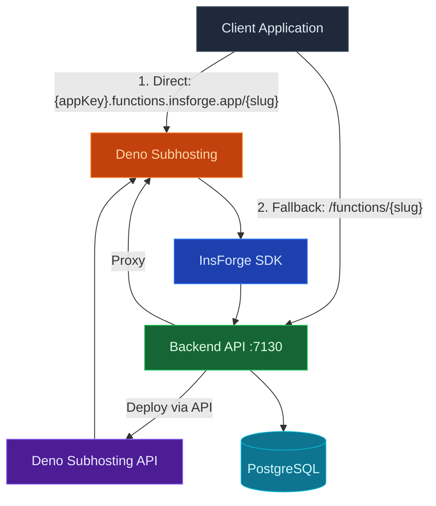
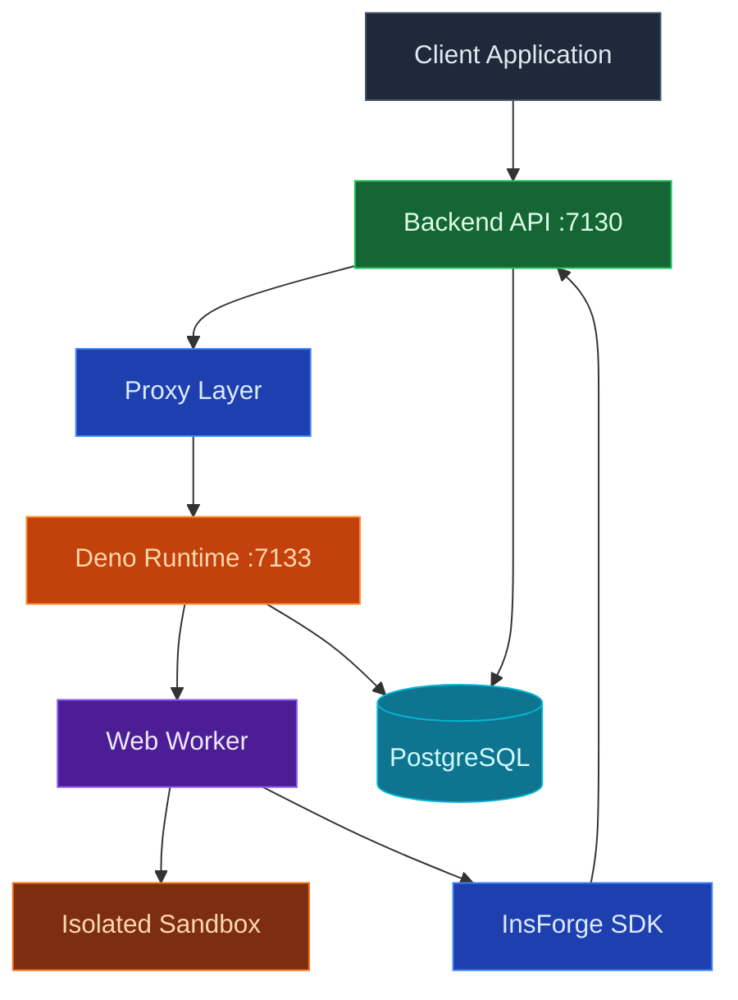
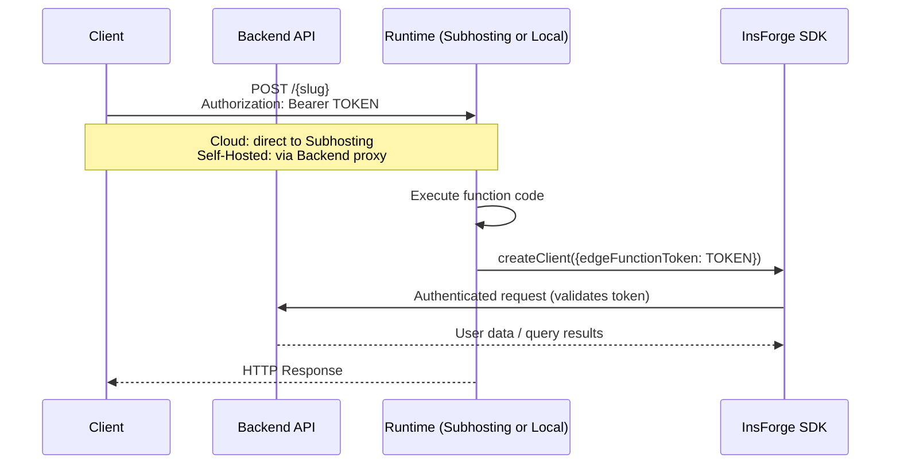

## Overview

InsForge Functions provide a secure, scalable serverless compute platform that runs JavaScript/TypeScript code with full access to the InsForge SDK. The architecture supports two runtime modes depending on your deployment:

- **Cloud (InsForge Cloud)**: Functions are deployed to [Deno Subhosting](https://deno.com/subhosting), giving you globally distributed edge execution with zero infrastructure management.
- **Self-Hosted (Docker)**: Functions run in a local Deno runtime process alongside your backend, executing in isolated Web Workers.

## Architecture

### Cloud — Deno Subhosting

In cloud mode, the SDK routes requests using a smart fallback strategy:

1. **Direct**: SDK calls `https://{appKey}.functions.insforge.app/{slug}` (Deno Subhosting)
2. **Fallback**: If direct returns 404, SDK falls back to `https://{appKey}.{region}.insforge.app/functions/{slug}` (backend proxy)
3. **Error**: Non-404 errors from direct are returned immediately (no fallback)

The SDK automatically derives the subhosting URL from your base URL when it matches the `*.insforge.app` domain pattern.

### Self-Hosted — Local Deno Runtime

In self-hosted mode, requests always go through the backend proxy:

1. Client calls `POST /functions/{slug}` on the backend
2. Backend proxies to the local Deno runtime (`localhost:7133`)
3. Deno runtime loads function code and executes it in an isolated Web Worker
4. Response is returned through the proxy

## Core Components

### Cloud

| Component | Technology | Purpose |
|-----------|------------|---------|
| **Backend API** | Node.js/Express | Function management, deployment orchestration, proxy fallback |
| **Deno Subhosting** | Deno Deploy infrastructure | Globally distributed edge execution |
| **Deno Subhosting API** | `api.deno.com/v1` | Deployment, project, and domain management |
| **Database** | PostgreSQL | Function code, metadata, and deployment records |
| **SDK** | @insforge/sdk | Client-side invocation with smart routing |
| **Secrets** | AES-256-GCM | Encrypted environment variables passed to deployments |

### Self-Hosted

| Component | Technology | Port | Purpose |
|-----------|------------|------|---------|
| **Backend API** | Node.js/Express | 7130 | Function management, authentication, proxy |
| **Runtime** | Deno | 7133 | Secure JavaScript/TypeScript execution |
| **Sandbox** | Web Workers | — | Isolated execution environment |
| **Database** | PostgreSQL | 5432 | Function code and metadata storage |
| **SDK** | @insforge/sdk | — | Available inside functions for backend access |
| **Secrets** | AES-256-GCM | — | Encrypted environment variables |

## How It Works

### Cloud Deployment

When a function is created or updated with `status: "active"`:

1. Backend saves the function code to the database
2. Backend bundles **all** active functions into a single Deno Subhosting project
3. An auto-generated router (`main.ts`) handles path-based routing between functions
4. Legacy `module.exports` format is automatically transformed to Deno-native `export default`
5. Deployment is pushed to Deno Subhosting API with secrets as environment variables
6. Backend polls until deployment succeeds, then records the deployment URL

Once deployed, functions are accessible at `https://{appKey}.functions.insforge.app/{slug}`.

### Self-Hosted Execution

When a client makes a request to `/functions/{slug}`:

1. The backend API receives and validates the request
2. Request is proxied to the local Deno runtime on port 7133
3. Function code is loaded from the database and executed in an isolated Web Worker
4. The function has access to the InsForge SDK and environment variables
5. Response is returned to the client through the proxy

### Authentication Flow

Functions receive the user's auth token via the `Authorization` header. Inside the function, create an SDK client with `edgeFunctionToken` to make authenticated requests that respect Row Level Security.

## Performance Characteristics

### Execution Limits

| Limit | Cloud (Subhosting) | Self-Hosted |
|-------|-------------------|-------------|
| **Timeout** | 30 seconds | 30 seconds |
| **Payload Size** | 10MB | 10MB |
| **Cold Start** | Managed by Deno Subhosting | ~50–200ms (worker creation) |
| **Concurrency** | Managed by Deno Subhosting | Limited by server resources |
| **Memory** | Managed by Deno Subhosting | Depends on Deno worker allocation |

### Optimization Strategies

**Cloud:**
1. **Global Distribution**: Deno Subhosting runs functions at the edge, close to users
2. **Bundled Deployment**: All active functions deploy as a single project, sharing startup cost
3. **Automatic Scaling**: Deno Subhosting handles scaling and isolate management

**Self-Hosted:**
1. **On-Demand Workers**: A new worker is created per invocation and terminated after completion/timeout
2. **Keep Function Logic Lean**: Minimize startup work inside handlers to reduce per-request overhead
3. **Runtime Health**: Monitor runtime availability and latency to avoid proxy failures
4. **Scale Host Resources**: Concurrency is bounded by host CPU/memory in self-hosted mode

## Best Practices

1. **Keep Functions Small**: Single responsibility per function
2. **Handle Errors Gracefully**: Always return proper HTTP responses
3. **Validate Input**: Check request data before processing
4. **Use Caching**: Cache frequently accessed data
5. **Optimize Queries**: Use efficient database queries
6. **Monitor Performance**: Track execution times and errors
7. **Secure Secrets**: Never log sensitive data
8. **Test Locally**: Test functions before deployment

## SDK References

<CardGroup cols={1}>
  <Card title="TypeScript" icon="js" href="/sdks/typescript/functions">
    Invoke serverless functions from web and Node.js applications
  </Card>
</CardGroup>

<Note>
Functions SDK is currently only available for TypeScript. Mobile SDKs (Swift, Kotlin) can invoke functions via HTTP requests to the functions endpoint.
</Note>
