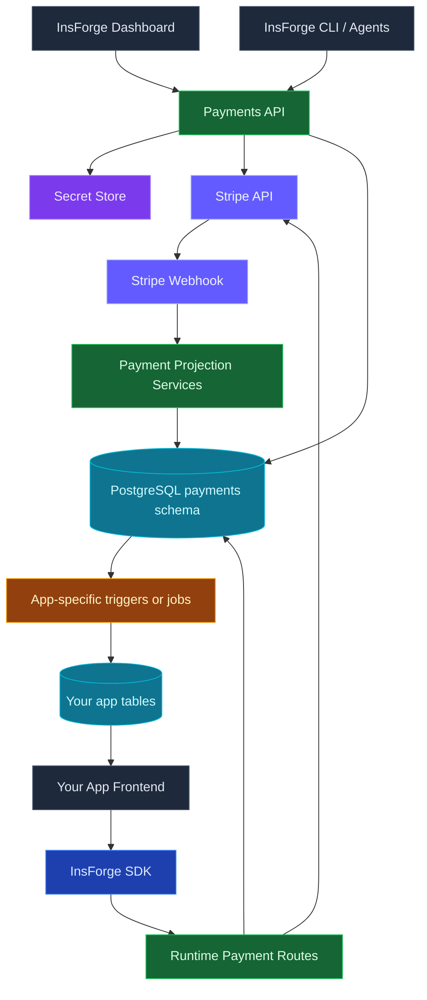

<Warning>
  Payments is a private preview feature. APIs and behavior may change.
</Warning>

## Overview

InsForge Payments helps developers add Stripe payment flows to generated applications without putting Stripe secret keys in frontend code. Developers configure their own Stripe account, agents manage products and prices, and app frontends create Stripe Checkout and Billing Portal sessions through InsForge.

Stripe remains the source of truth. InsForge syncs Stripe catalog data and the payment state needed for checkout, subscriptions, and webhook-driven fulfillment into a `payments` schema so the dashboard, agents, and your app logic can work with it reliably.

Inside InsForge, Payments Settings is where you configure Stripe keys, sync data, and manage webhooks. The main Payments area gives you a straightforward dashboard for checking the catalog, customers, subscriptions, and payment history across test and live environments.

<Note>
  InsForge does not decide what a successful payment means for your app. Use the payment projection tables to update your own app tables, such as `orders`, `credits`, `team_entitlements`, or `billing_status`.
</Note>

<Note>
  InsForge is not trying to replace the Stripe Dashboard. Use Stripe directly for refunds, disputes, and other sensitive financial operations. Use InsForge to integrate the payment flow quickly and keep an eye on the most important payment data while you build.
</Note>

## Technology Stack



## Core Model

InsForge uses the developer-owned Stripe account model. Each project can configure:

| Environment | Secret key | Purpose |
|-------------|------------|---------|
| `test` | `STRIPE_TEST_SECRET_KEY` | Development and agent implementation |
| `live` | `STRIPE_LIVE_SECRET_KEY` | Production payments |

Test and live are independent targets. Every synced payment table stores an `environment` column instead of using separate test/live table sets.

<Warning>
  Agents should default to Stripe test mode while building. Only target `live` after the developer explicitly approves production Stripe changes.
</Warning>

## Configuration Flow

Configure Stripe from the dashboard Payments settings, or through the CLI:

```bash
npx @insforge/cli payments status
npx @insforge/cli payments config set test sk_test_xxx
npx @insforge/cli payments config set live sk_live_xxx
npx @insforge/cli payments sync
```

See [Payments CLI](/core-concepts/payments/cli) for the full admin and agent command workflow.

When a key is configured, InsForge validates it against Stripe, records the Stripe account identity, stores the secret in the InsForge secret store, best-effort configures the managed webhook, and syncs Stripe state when the account changes.

If the backend URL is not publicly accessible, Stripe webhook creation can fail while key configuration still succeeds. Retry webhook setup after deploying to a public URL:

```bash
npx @insforge/cli payments webhooks configure test
npx @insforge/cli payments webhooks configure live
```

## Dashboard and Stripe Responsibilities

| Surface | What it does |
|---------|--------------|
| Dashboard settings | Configure Stripe test/live keys, run sync, and create or recreate managed webhooks |
| Dashboard pages | Quickly review Catalog, Customers, Subscriptions, and Payment History for `test` or `live` |
| Admin API + CLI | Power the same configuration, sync, catalog CRUD, projection reads, and webhook setup flows used by agents and automation |
| Stripe Dashboard | Handle refunds, disputes, and other sensitive payment operations directly in Stripe |

## Catalog Management

Products and prices are managed in Stripe first, then synced into InsForge.

```bash
npx @insforge/cli payments products create \
  --environment test \
  --name "Pro Plan" \
  --description "Monthly access" \
  --idempotency-key "product:pro"

npx @insforge/cli payments prices create \
  --environment test \
  --product prod_123 \
  --currency usd \
  --unit-amount 1900 \
  --interval month \
  --idempotency-key "price:pro:monthly"
```

Stripe prices are immutable for amount, currency, and recurring cadence. To change those fields, create a new price and archive the old one.

## Data Model

The `payments` schema stores Stripe connection metadata, synced catalog and customer data, checkout attempts, subscriptions, payment history, and webhook processing state.

| Table | Purpose |
|-------|---------|
| `payments.stripe_connections` | One row per environment with Stripe account, key, webhook, and sync status |
| `payments.products` | Synced Stripe products |
| `payments.prices` | Synced Stripe prices |
| `payments.customers` | Synced Stripe customers shown in the dashboard for quick visibility |
| `payments.checkout_sessions` | Local Checkout Session attempts created by app frontends |
| `payments.customer_portal_sessions` | Local Billing Portal Session attempts |
| `payments.stripe_customer_mappings` | Maps app billing subjects to Stripe customers |
| `payments.subscriptions` | Synced Stripe subscription state |
| `payments.subscription_items` | Synced subscription item and price state |
| `payments.payment_history` | One-time payments, subscription invoices, failed payments, and refunds |
| `payments.webhook_events` | Stripe webhook deduplication and processing status |

### Customer Dashboard Data vs Customer Mappings

InsForge keeps customer-related state in two separate places on purpose:

- `payments.customers` stores synced Stripe customer records for the InsForge dashboard. Full sync and customer webhooks keep it current so you can quickly review payment counts, last payment time, total spend, country, and primary payment method details when Stripe provided them.
- `payments.stripe_customer_mappings` is the operational subject-to-customer lookup. Runtime portal creation and subscription ownership checks use this mapping. Checkout completion upserts mappings, and customer deletion removes them.

### Billing Subjects

A billing subject is the app-defined owner of a customer or subscription:

```json
{ "type": "team", "id": "team_123" }
```

The subject can represent a user, team, organization, workspace, tenant, group, or any other app-specific billing owner. InsForge stores this as `subject_type` and `subject_id`; your app decides what those values mean.

## Runtime Checkout Flow

Use the TypeScript SDK from your app frontend:

```typescript
const { data, error } = await insforge.payments.createCheckoutSession({
  environment: 'test',
  mode: 'payment',
  lineItems: [{ stripePriceId: 'price_123', quantity: 1 }],
  successUrl: `${window.location.origin}/checkout/success`,
  cancelUrl: `${window.location.origin}/pricing`,
  customerEmail: user?.email ?? null,
  metadata: { order_id: orderId },
  idempotencyKey: `order:${orderId}`
});

if (error) throw error;
if (data?.checkoutSession.url) {
  window.location.assign(data.checkoutSession.url);
}
```

Checkout creation works in two steps:

1. InsForge inserts a row in `payments.checkout_sessions` using the caller's role and JWT context.
2. InsForge creates the Stripe Checkout Session. If Stripe succeeds, the local row becomes `open` and stores the Stripe URL.

For one-time checkout, `subject` is optional. For subscription checkout, `subject` is required because ongoing access belongs to an app-defined billing owner.

If one-time checkout includes a `subject` but no existing `payments.stripe_customer_mappings` row, InsForge asks Stripe to create the customer during Checkout and backfills both the subject mapping and the dashboard customer data when the completion webhook arrives.

```typescript
await insforge.payments.createCheckoutSession({
  environment: 'test',
  mode: 'subscription',
  subject: { type: 'team', id: teamId },
  lineItems: [{ stripePriceId: 'price_monthly_123', quantity: 1 }],
  successUrl: `${window.location.origin}/billing/success`,
  cancelUrl: `${window.location.origin}/billing`,
  customerEmail: user.email,
  idempotencyKey: `team:${teamId}:pro-monthly`
});
```

<Warning>
  Success URLs are for user experience only. Do not fulfill orders, grant credits, or activate subscriptions from the success page. Use webhook-projected payment state instead.
</Warning>

## Customer Portal Flow

Use Stripe Billing Portal when customers need to manage subscriptions, invoices, payment methods, or cancellation.

```typescript
const { data, error } = await insforge.payments.createCustomerPortalSession({
  environment: 'test',
  subject: { type: 'team', id: teamId },
  returnUrl: `${window.location.origin}/billing`
});

if (error) throw error;
if (data?.customerPortalSession.url) {
  window.location.assign(data.customerPortalSession.url);
}
```

Portal creation requires an authenticated user and an existing `payments.stripe_customer_mappings` row for the subject. That mapping is usually created after a Checkout Session completes and Stripe returns a customer. The dashboard customer row in `payments.customers` is not enough by itself because the portal flow needs a subject-to-customer mapping, not just synced customer data.

## Webhook Projection Flow

Managed Stripe webhooks update InsForge's payment projections. The webhook handler verifies Stripe signatures, deduplicates events, and records processing state in `payments.webhook_events`.

InsForge listens for events that keep checkout, subscriptions, payment history, and dashboard visibility current:

| Event family | Examples | Projection |
|--------------|----------|------------|
| Customers | `customer.created`, `customer.updated`, `customer.deleted` | synced customer records for the dashboard, plus mapping cleanup on deletion |
| Checkout | `checkout.session.completed`, `checkout.session.async_payment_succeeded`, `checkout.session.async_payment_failed`, `checkout.session.expired` | `checkout_sessions`, customer mappings, one-time payment history |
| Invoices | `invoice.paid`, `invoice.payment_succeeded`, `invoice.payment_failed` | subscription invoice payment history |
| PaymentIntents | `payment_intent.succeeded`, `payment_intent.payment_failed` | payment history |
| Refunds | `charge.refunded`, `refund.created`, `refund.updated`, `refund.failed` | refund rows and original payment refund status |
| Subscriptions | `customer.subscription.created`, `customer.subscription.updated`, `customer.subscription.deleted`, `customer.subscription.paused`, `customer.subscription.resumed` | subscriptions and subscription items |

Webhook delivery can be duplicated or out of order. InsForge processing is idempotent, and your custom fulfillment logic should be idempotent too.

Stripe's own guidance is the same: use webhooks for fulfillment, make fulfillment safe to run multiple times, don't depend on event ordering, and return quickly from webhook handlers. See Stripe's [Checkout fulfillment guide](https://docs.stripe.com/checkout/fulfillment) and [webhook best practices](https://docs.stripe.com/webhooks#best-practices).

## Custom Fulfillment Logic

InsForge cannot know what a successful payment means for every app. Your agent should create app-specific tables, triggers, or jobs based on your product model. Treat the `payments` schema as an internal projection layer, then copy the business result into your own public tables with RLS.

For example, a SaaS app might turn a paid subscription into `public.team_billing_status`, while a marketplace might turn a one-time payment into `public.orders.status = 'paid'`. The frontend should read those app-owned tables, not the admin payment projection tables.

If the frontend needs to be notified immediately, publish or subscribe from the app-owned table. For example, use Realtime on `public.orders` after the fulfillment trigger marks the order `paid`. Avoid subscribing end users directly to `payments.payment_history`.

### Which Table Should Trigger Business Logic?

Use the most final payment projection available for the job:

| Business need | Recommended source | Why |
|---------------|--------------------|-----|
| Mark a one-time order paid | `payments.payment_history` where `type = 'one_time_payment'` and `status = 'succeeded'` | Handles webhook confirmation and delayed payment methods |
| Apply refunds or reduce credits | `payments.payment_history` refund rows, or original rows with `amount_refunded` | Refunds can arrive separately from the original payment |
| Activate or revoke subscription access | `payments.subscriptions` status and period fields | Captures subscription lifecycle changes, renewals, cancellations, and sync repair |
| Record invoice/payment ledger entries | `payments.payment_history` where `type = 'subscription_invoice'` | Captures paid and failed recurring invoices |
| Track local checkout attempts | `payments.checkout_sessions` | Useful for metadata, idempotency, and debugging, but not the final fulfillment signal |

Do not fulfill directly from `payments.checkout_sessions.status = 'completed'`. Checkout completion is not always the same as money being available, especially with delayed payment methods. Use `payment_history.status = 'succeeded'` for one-time payment fulfillment and `subscriptions.status` for subscription access.

Typical app-owned tables include:

| Use case | App-owned table |
|----------|-----------------|
| Ecommerce orders | `public.orders` |
| Credit packs | `public.credit_ledger` |
| Paid content | `public.user_entitlements` |
| Team subscriptions | `public.team_billing_status` |
| Async side effects | `public.fulfillment_jobs` |

### One-Time Checkout Fulfillment Example

Create your order before Checkout, pass the order ID in Checkout metadata, then fulfill from webhook-projected payment history. The trigger below is intentionally idempotent: repeated webhook deliveries or manual sync repairs update the same order and do not double-fulfill it.

```sql
CREATE TABLE IF NOT EXISTS public.orders (
  id UUID PRIMARY KEY DEFAULT gen_random_uuid(),
  user_id UUID NOT NULL REFERENCES auth.users(id),
  status TEXT NOT NULL DEFAULT 'pending'
    CHECK (status IN ('pending', 'paid', 'fulfilled', 'canceled', 'refunded')),
  stripe_checkout_session_id TEXT,
  stripe_payment_intent_id TEXT,
  paid_at TIMESTAMPTZ,
  updated_at TIMESTAMPTZ NOT NULL DEFAULT NOW()
);

ALTER TABLE public.orders ENABLE ROW LEVEL SECURITY;

CREATE POLICY "users read own orders"
ON public.orders
FOR SELECT
TO authenticated
USING (user_id = auth.uid());

CREATE OR REPLACE FUNCTION public.fulfill_paid_order()
RETURNS TRIGGER AS $$
BEGIN
  IF NEW.type <> 'one_time_payment' OR NEW.status <> 'succeeded' THEN
    RETURN NEW;
  END IF;

  WITH checkout_order AS (
    SELECT (cs.metadata->>'order_id')::uuid AS order_id
    FROM payments.checkout_sessions AS cs
    WHERE cs.stripe_checkout_session_id = NEW.stripe_checkout_session_id
      AND cs.metadata->>'order_id' ~* '^[0-9a-f-]{8}-[0-9a-f-]{4}-[0-9a-f-]{4}-[0-9a-f-]{4}-[0-9a-f-]{12}$'
  )
  UPDATE public.orders AS o
  SET
    status = 'paid',
    paid_at = COALESCE(NEW.paid_at, NOW()),
    stripe_checkout_session_id = NEW.stripe_checkout_session_id,
    stripe_payment_intent_id = NEW.stripe_payment_intent_id,
    updated_at = NOW()
  FROM checkout_order
  WHERE o.id = checkout_order.order_id
    AND o.status = 'pending';

  RETURN NEW;
END;
$$ LANGUAGE plpgsql SECURITY DEFINER;

CREATE TRIGGER fulfill_paid_order
AFTER INSERT OR UPDATE OF status
ON payments.payment_history
FOR EACH ROW
EXECUTE FUNCTION public.fulfill_paid_order();
```

Frontend checkout code should create the pending order first and include the order ID in metadata:

```typescript
const { data: order } = await insforge
  .from('orders')
  .insert([{ user_id: user.id, status: 'pending' }])
  .select()
  .single();

const { data, error } = await insforge.payments.createCheckoutSession({
  environment: 'test',
  mode: 'payment',
  lineItems: [{ stripePriceId: 'price_123', quantity: 1 }],
  successUrl: `${window.location.origin}/orders/${order.id}`,
  cancelUrl: `${window.location.origin}/pricing`,
  customerEmail: user.email,
  metadata: { order_id: order.id },
  idempotencyKey: `order:${order.id}`
});

if (error) throw error;
if (data?.checkoutSession.url) window.location.assign(data.checkoutSession.url);
```

<Warning>
  The success page may show "processing" and poll the app-owned `orders` row, but it should not mark the order paid by itself. Stripe explicitly recommends webhooks because customers are not guaranteed to reach the success page after payment.
</Warning>

### Subscription Entitlement Example

For subscriptions, update an app-owned entitlement or billing status table from `payments.subscriptions`.

```sql
CREATE OR REPLACE FUNCTION public.sync_team_billing_status()
RETURNS TRIGGER AS $$
BEGIN
  IF NEW.subject_type <> 'team'
     OR NEW.subject_id IS NULL
     OR NEW.subject_id !~* '^[0-9a-f-]{8}-[0-9a-f-]{4}-[0-9a-f-]{4}-[0-9a-f-]{4}-[0-9a-f-]{12}$' THEN
    RETURN NEW;
  END IF;

  INSERT INTO public.team_billing_status (
    team_id,
    stripe_subscription_id,
    status,
    current_period_end,
    updated_at
  )
  VALUES (
    NEW.subject_id::uuid,
    NEW.stripe_subscription_id,
    NEW.status,
    NEW.current_period_end,
    NOW()
  )
  ON CONFLICT (team_id) DO UPDATE SET
    stripe_subscription_id = EXCLUDED.stripe_subscription_id,
    status = EXCLUDED.status,
    current_period_end = EXCLUDED.current_period_end,
    updated_at = NOW();

  RETURN NEW;
END;
$$ LANGUAGE plpgsql SECURITY DEFINER;

CREATE TRIGGER sync_team_billing_status
AFTER INSERT OR UPDATE OF status, current_period_end, cancel_at_period_end
ON payments.subscriptions
FOR EACH ROW
EXECUTE FUNCTION public.sync_team_billing_status();
```

In most SaaS apps, treat `active` and `trialing` as access-granting states, and treat `canceled`, `unpaid`, and `incomplete_expired` as access-revoking states. Stripe also recommends handling `past_due` deliberately: you might keep access during retry windows, show a billing warning, or restrict premium features based on your product policy.

<Warning>
  Do not call external APIs directly from database triggers. For emails, shipping, webhooks, or other side effects, insert a row into an app-owned outbox table and process it from an edge function or background worker.
</Warning>

### Agent Fulfillment Checklist

When an agent integrates Payments into an app, it should:

1. Identify the app's billing owner: user, team, organization, tenant, or anonymous order.
2. Create app-owned read models such as `orders`, `credit_ledger`, or `team_billing_status`.
3. Add RLS to app-owned tables before exposing them in the frontend.
4. Add RLS to `payments.checkout_sessions` and `payments.customer_portal_sessions` when users can pass a `subject`.
5. Add idempotent triggers from `payments.payment_history` or `payments.subscriptions` into the app-owned tables.
6. Use app-owned table updates or Realtime messages to notify the frontend.
7. Use outbox rows or edge functions for emails, shipping, analytics, or other external side effects.
8. Test with Stripe test mode, including success, failed payment, delayed payment, renewal, cancellation, and refund paths.

## Session Authorization and RLS

The runtime payment routes insert into `payments.checkout_sessions` and `payments.customer_portal_sessions` using the caller context. By default, the migration grants insert/select access for these session tables so apps can start quickly.

`createCheckoutSession(...)` supports guest or signed-in one-time checkout flows. `createCustomerPortalSession(...)` is stricter and rejects anonymous callers because it operates on an existing billing subject mapping.

If users can pass a `subject`, add app-specific RLS policies before shipping subscription checkout or portal UI. For example, if subscriptions belong to teams, only team members should be able to create checkout or portal sessions for that team.

```sql
ALTER TABLE payments.checkout_sessions ENABLE ROW LEVEL SECURITY;
ALTER TABLE payments.customer_portal_sessions ENABLE ROW LEVEL SECURITY;

CREATE POLICY "team members create checkout sessions"
ON payments.checkout_sessions
FOR INSERT
TO authenticated
WITH CHECK (
  subject_type = 'team'
  AND EXISTS (
    SELECT 1
    FROM public.team_members tm
    WHERE tm.team_id = subject_id::uuid
      AND tm.user_id = auth.uid()
  )
);

CREATE POLICY "team members create portal sessions"
ON payments.customer_portal_sessions
FOR INSERT
TO authenticated
WITH CHECK (
  subject_type = 'team'
  AND EXISTS (
    SELECT 1
    FROM public.team_members tm
    WHERE tm.team_id = subject_id::uuid
      AND tm.user_id = auth.uid()
  )
);
```

Adjust table names, casts, and membership checks to match your app schema.

## Runtime Payment State

The frontend SDK currently exposes creation flows only:

- `insforge.payments.createCheckoutSession(...)`
- `insforge.payments.createCustomerPortalSession(...)`

The synced Payments tables such as `payments.customers`, `payments.subscriptions`, and `payments.payment_history` are not a generic end-user read surface. If your app needs users to see subscription status, order status, credits, or entitlements, create app-owned tables with RLS and populate them from payment projections.

## Local Development

Stripe requires webhook endpoints to be publicly accessible. Localhost backend URLs cannot be registered as Stripe webhook endpoints from the dashboard or CLI.

For local testing:

1. Configure the Stripe test key.
2. Build checkout with `environment: 'test'`.
3. Use the Stripe CLI to forward events to your local backend webhook endpoint.
4. Confirm your app-owned fulfillment tables update from webhook-projected payment state.

## Current Limitations

<Note>
  Payments private preview intentionally starts with a small, stable surface.
</Note>

| Limitation | Details |
|------------|---------|
| Developer-owned Stripe accounts only | Connected Accounts, claimable sandboxes, and platform-managed onboarding are not part of this phase |
| No test-to-live publishing | Agents explicitly target `test` or `live` environments |
| No generic end-user read API | Build app-owned read models with RLS for entitlements and billing status |
| Not a full Stripe Dashboard replacement | InsForge focuses on integration, configuration, and quick visibility. Use Stripe directly for refunds, disputes, and advanced payment operations |
| No default business fulfillment | Agents generate custom triggers/jobs based on your app schema |

## Best Practices

<CardGroup cols={2}>
  <Card title="Start in Test Mode" icon="flask">
    Build and verify checkout with Stripe test keys before touching live data.
  </Card>

  <Card title="Use Idempotency Keys" icon="fingerprint">
    Use stable keys for product, price, and checkout creation to avoid duplicates during retries.
  </Card>

  <Card title="Fulfill from Webhooks" icon="webhook">
    Use payment projection tables, not success redirects, to grant access or mark orders paid.
  </Card>

  <Card title="Own Your App State" icon="table">
    Store user-facing status in app-owned tables with RLS.
  </Card>

  <Card title="Protect Billing Subjects" icon="shield-check">
    Add RLS before exposing team, organization, or subscription management flows.
  </Card>

  <Card title="Keep Secrets Server-Side" icon="key">
    Never put Stripe secret keys in frontend code or public deployment variables.
  </Card>
</CardGroup>

## Related Pages

<CardGroup cols={2}>
  <Card title="Payments CLI" icon="terminal" href="/core-concepts/payments/cli">
    Configure Stripe keys, sync catalog state, manage products and prices, and inspect projections
  </Card>

  <Card title="TypeScript" icon="js" href="/sdks/typescript/payments">
    Create Checkout Sessions and Billing Portal Sessions from web applications
  </Card>
</CardGroup>
